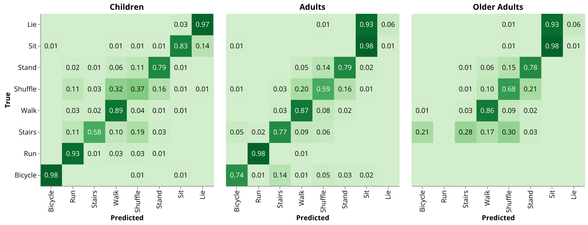
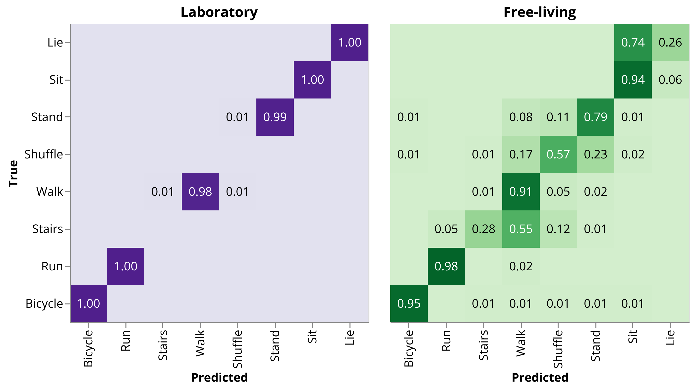

# ActiMotus Validation — Reproducibility Package

[](https://doi.org/10.5281/zenodo.21955041)

Reproduces the validation of the [ActiMotus](https://github.com/actimotus/actimotus)
human activity recognition algorithm against video ground truth, on five public
accelerometry datasets covering children, adults and older adults.

Three commands regenerate every table and confusion matrix in the study. No data is
redistributed here: it is fetched from HuggingFace at pinned revisions and the
algorithm comes from PyPI, so the package supplies only the pipeline between them.
The generated tables and figures are committed under `results/` so they can be read
without running anything; re-running overwrites them.

## Run it

```bash
uv sync
uv run python scripts/01_features.py    # ~2 GB download, tens of minutes
uv run python scripts/02_activities.py  # seconds
uv run python scripts/03_analysis.py    # seconds
```

Results land in `results/` as `.xlsx` tables and `.png` confusion matrices.
Add `--dataset <name>` to restrict stages 1–2 to one dataset, `--limit N` for a quick
smoke run, `--only <stem>` to rebuild a single stage 3 output.

Each stage stamps its output with the ActiMotus version and dataset revisions it
used, and refuses to consume a cache built from different inputs — a stale cache is
an error, not a source of plausible wrong numbers.

## Datasets

| Dataset | Population | Sensors | HuggingFace | License |
|---|---|---|---|---|
| Lendt Adults | 35 adults | lateral thigh, SENS 12.5 Hz | `josefheidler/har_adults_2024-lendt` | CC-BY-4.0 |
| NTNU Children | 46 typically-developing children | thigh + back, AX3 50 Hz | `josefheidler/har_children_2024-harth` | CC0-1.0 |
| NTNU Adults | 31 adults | thigh + back, AX3 50 Hz | `josefheidler/har_adults_2021-harth` | MIT |
| NTNU Older Adults | 18 adults aged 70–95 | thigh + back, AX3 50 Hz | `josefheidler/har_older-adults_2023-harth` | CC-BY-4.0 |
| NTNU Walking Speeds | 24 adults | thigh + back, AX3 50 Hz | `josefheidler/har_ws_adults_2025-harth` | CC-BY-4.0 |

Revisions are pinned in `datasets.toml`. This package redistributes no data; the
dataset licenses bind you at download, and CC-BY-4.0 requires attribution to the
source study listed on each dataset card.

## Results

F1 per activity against video ground truth, ActiMotus 2.3.3 with its built-in
`DEFAULT` thresholds, thigh sensor only:

| Dataset | Lie | Sit | Stand | Shuffle | Walk | Stairs | Run | Cycle |
|---|---|---|---|---|---|---|---|---|
| Lendt, laboratory | 1.00 | 1.00 | 0.99 | — | 0.99 | — | 1.00 | 1.00 |
| Lendt, free-living | 0.08 | 0.90 | 0.77 | 0.43 | 0.89 | 0.35 | 0.97 | 0.97 |
| NTNU Children | 0.79 | 0.83 | 0.81 | 0.33 | 0.88 | 0.45 | 0.82 | 0.88 |
| NTNU Adults | 0.08 | 0.79 | 0.79 | 0.38 | 0.84 | 0.62 | 0.93 | 0.89 |
| NTNU Older Adults | 0.05 | 0.82 | 0.83 | 0.29 | 0.86 | 0.18 | — | — |
| NTNU Walking Speeds | — | — | — | — | 0.79 | — | 0.98 | — |

Walking speeds is the only protocol that separates fast walking from walking, since
speed cannot be established from free-living video: F1 0.79 for walking and 0.65 for
fast walking. Elsewhere the two are pooled as `walk`.





Rows are normalised over the true class. The remaining figures — fused classes, the
thigh + trunk configuration and walking speeds — are in `results/`, alongside the
`.xlsx` tables and a `provenance.json` recording the ActiMotus version and dataset
revisions that produced them.

Adding the lower-back sensor changes **only lying and sitting**; every other activity
is unchanged to two decimals, since the trunk feeds only that discrimination:

| Dataset | Lie, thigh | Lie, +trunk | Sit, thigh | Sit, +trunk |
|---|---|---|---|---|
| NTNU Children | 0.79 | **0.90** | 0.83 | 0.93 |
| NTNU Adults | 0.08 | **0.90** | 0.79 | 0.91 |
| NTNU Older Adults | 0.05 | **0.77** | 0.82 | 0.87 |

### Fused classes

Collapsing to five behaviour classes — sedentary (lying + sitting), standing
(standing + shuffling), walking (walking + fast walking + stairs), running and
cycling — gives F1, thigh sensor only:

| Dataset | Sedentary | Standing | Walking | Running | Cycling |
|---|---|---|---|---|---|
| Lendt, laboratory | 1.00 | 0.99 | 0.99 | 1.00 | 1.00 |
| Lendt, free-living | 0.99 | 0.83 | 0.91 | 0.97 | 0.97 |
| NTNU Children | 0.97 | 0.85 | 0.89 | 0.82 | 0.88 |
| NTNU Adults | 0.95 | 0.82 | 0.85 | 0.93 | 0.89 |
| NTNU Older Adults | 0.99 | 0.84 | 0.91 | — | — |

The lower-back sensor makes no difference here — every fused F1 is unchanged to two
decimals with or without it. Its whole contribution is separating lying from sitting,
and both collapse into sedentary.

Precision, recall and F1 with 90% confidence intervals, computed per participant and
then averaged across participants, are written to the `.xlsx` tables in `results/`,
alongside confusion matrices as `.png`, for both the eight-activity and fused
vocabularies.

## Sensor orientation

The published datasets use a hub frame with `x` up along the limb, `y` right and
`z` forward. The two sensors need opposite treatment, so `data.sensor_frame` takes a
required `to_acti_frame` argument rather than guessing:

- **Thigh** — rotated 180° about its long axis (`y` and `z` negated). ActiMotus
  expects the thigh `z` posterior. Without this, Lendt falls from 0.952 to 0.665.
- **Back** — left as published. ActiMotus expects the trunk `z` anterior, which the
  hub frame already provides.

Automatic flip detection stays enabled, but only as a guard against genuinely
mis-worn sensors — never as a substitute for the conversion. With the frames correct
it changes nothing on 153 of 154 thigh recordings, and both `orientation=True` and
`orientation=False` give identical predictions, an invariant enforced by
`tests/test_integration.py`.

## Known limitations

- Thresholds are ActiMotus's built-in `DEFAULT` configuration, tuned by Bayesian
  optimization outside this package. Re-deriving them is out of scope.
- Lying detection from the thigh alone fails for adults and older adults (recall
  0.06 in both); the back sensor resolves it (0.87 and 0.78). Children are the
  exception, reaching 0.97 from the thigh alone.

## Citing

Please cite the validation study, not this repository. The article is under review;
its DOI will be added here on publication.

If you need to reference the code specifically — for example to pin the exact version
that produced a result — this package also has a DOI,
[10.5281/zenodo.21955041](https://doi.org/10.5281/zenodo.21955041), which always
resolves to the latest release.

The datasets are cited separately. Each HuggingFace card names the study to
attribute; CC-BY-4.0 requires it.

## License

BSD 3-Clause, matching [ActiMotus](https://github.com/actimotus/actimotus). See
`LICENSE`.
